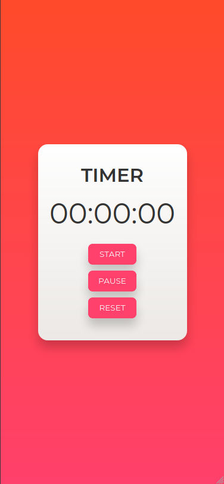
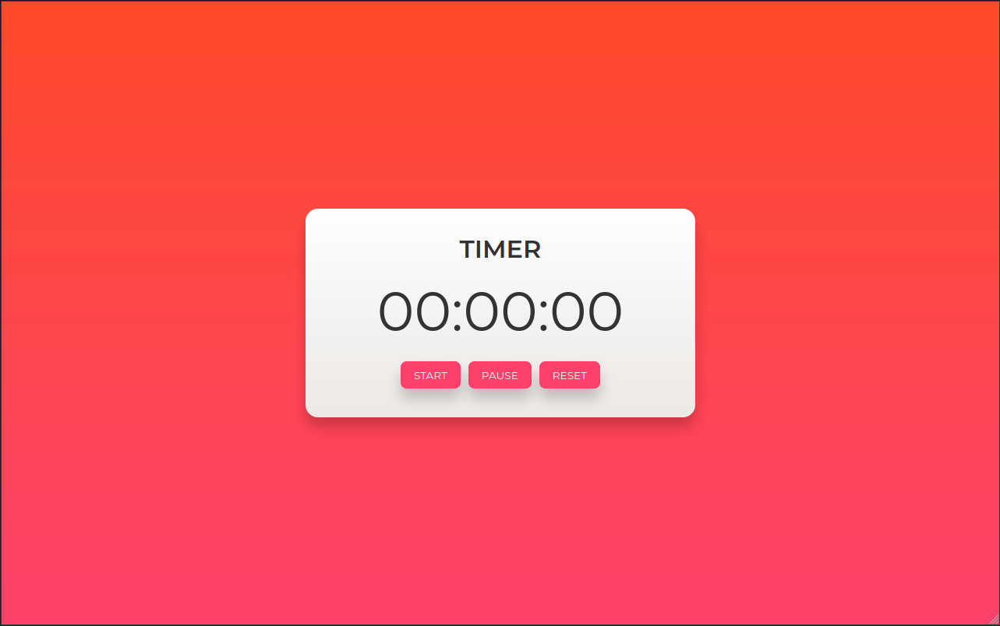

<h1 align="center" id="title">JavaScript Timer</h1>

<p align="center">A simple timer counter development using js!</p>

<p align="center">
<a href="https://sonarcloud.io/dashboard?id=jmontejr_javascript-timer">

</a>
</p>

<br>

## Tabela de conteúdos
<!--ts-->
   * [Overview](#overview)
   * [Tecnologias](#tecnologias)
   * [Obtendo o projeto](#obtendo-o-projeto)
   * [Visualizando o projeto](#visualizando-o-projeto)
   * [Melhorias e ideias Sugeridas](#melhorias-e-ideias-sugeridas)
   * [Autor](#autor)
<!--te-->

## Overview

O Timer é um dos exercícios presentes na Seção 3 do [Curso de JavaScript e TypeScript do básico ao avançado 2021](https://www.udemy.com/course/curso-de-javascript-moderno-do-basico-ao-avancado/).

O projeto foi desenvolvido utilizando o JavaScript, HTML5 e CSS3.

Ir para o [topo](#title).

## Tecnologias
As seguintes tecnologias foram usadas na construção do projeto:

- [JavaScript](https://developer.mozilla.org/pt-BR/docs/Web/JavaScript)
- [HTML](https://developer.mozilla.org/pt-BR/docs/Web/HTML)
- [CSS](https://developer.mozilla.org/pt-BR/docs/Web/CSS)

Ir para o [topo](#title).

## Obtendo o projeto

Abra um terminal de comandos na pasta onde deseja salvar o projeto e digite o comando abaixo:

```git
$ git clone https://github.com/jmontejr/javascript-counter.git
```

Ou baixe o arquivo comprimido diretamente do repositório do projeto no Github e descompacte onde desejar.


Ir para o [topo](#title).

## Visualizando o Projeto

Para visualizar o projeto basta acessar o [link](https://jmontejr.github.io/javascript-timer) ou assim que for realizado o clone do repositório, acessar a pasta onde o projeto foi baixado e abrir o arquivo `index.html` no seu navegador de costume.

### 01- Mobile screen
<p align="center">
    
</p>

### 02- Desktop screen
<p align="center">
    
</p>

Ir para o [topo](#title).


### Melhorias e ideias Sugeridas

#### Melhorias realizadas:
- Refatoração do código para um código mais moderno e limpo;
- Adição de animação quando o timer for pausado (trabalhar com animações no css e inserção de classes de forma dinâmica usando o JavaScript)

#### Melhorias sugeridas:
- Recriar o projeto em algum Framework JavaScript
- Criar componentes de acordo com o que o projeto demanda


Ir para o [topo](#title).
### Autor

<h2>José Monte</h2>
<p>Desenvolvido com :heart:</p>
<div>
    <a href="https://jmontejr.github.io">
        
    </a>
    <space></space>
    <a href="https://www.linkedin.com/in/jmontejr">
        
    </a>
    <space></space>
    <a href="https://codepen.io/jmontejr">
        
    </a>
</div>

Ir para o [topo](#title).
